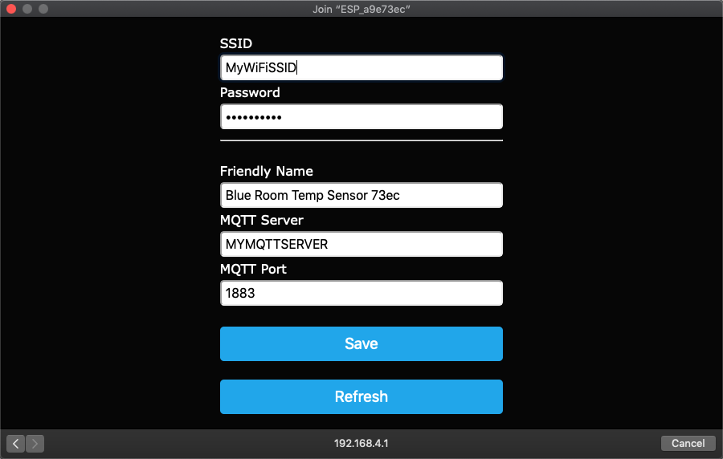

# WiFiMQTTManager

ESP32/ESP8266 library that encapsulates the [WiFiManager](https://github.com/tzapu/WiFiManager/tree/development) and [PubSub Client](https://github.com/knolleary/pubsubclient) Libraries and adds the ability to save SSID, WiFi password, and MQTT connection settings so that they don't have to be hard-coded in your sketches.  Also allows for user friendly naming of your IoT devices and publishes device registration data back to a Node Red Dashboard where you can initiate service actions on your devices (e.g. restart, or bring up it's access point to reconfigure/rename device, etc) 

It's assumed that you already know how to setup an [Arduino development environment](https://www.arduino.cc/en/Guide/HomePage), including [how to install libraries](https://www.arduino.cc/en/Guide/Libraries), and that you already have [MQTT](https://mosquitto.org/download/) and [Node Red](https://nodered.org/docs/getting-started/)/[Dashboard](https://flows.nodered.org/node/node-red-dashboard) installed.  

First cut at a library. Contributions are welcome.

## Requirements

* [WiFiManager Library (must use development branch)](https://github.com/tzapu/WiFiManager/tree/development)
* [Arduino Json Library](https://github.com/bblanchon/ArduinoJson)
* [PubSub Client Library](https://github.com/knolleary/pubsubclient)
    + NOTE: Change MQTT_MAX_PACKET_SIZE in PubSubClient.h to 512 

## Quick Start
1. Install the required libraries (see above)
2. Download [WiFiMQTTManager](https://github.com/dreed47/WifiMQTTManager/archive/master.zip) and unzip it in your Arduino libraries folder.  Make sure the folder name is "WiFiMQTTManager".
3. Edit the PubSubClient.h header file and change MQTT_MAX_PACKET_SIZE to 512
4. Import (then Deploy) into Node Red the Dashboard json found in [/nodered/services-export.json](./nodered/services-export.json) file (make sure you enter your MQTT server address in the two MQTT nodes in the flow)
5. Open Arduino IDE and attach your ESP32 or ESP8266 controller board to your computer (select the correct board and port)
6. In Arduino IDE open File->Examples->WiFiMQTTManager->Basic sketch
7. Change the AP_PASSWORD in secrets.h file to a suitable password for your device Access Points
8. Upload the sketch to your device (you may need to uncomment the wm.formatFS = true; line in the basic sketch but if you do make sure you comment it back out and re-load your sketch after the device file system is formatted) (the serial monitor window will show helpful information)
9. After a few seconds you should see a new SSID in your available WiFi Access Points in the formap of ESP_xxxxxxxx.  Select this SSID and a new configuration popup window will appear. 
10. Enter your SSID and password, your MQTT server address and port and give your device a user friendly name
11. A few seconds after your device is configured you should see the new device show up in the Service Dashboard dropdown widgets.

## Dashboard

## Access Point Configuration

## Support
For issues, feature requests, comments or questions, use the [Github issues tracker](https://github.com/dreed47/WifiMQTTManager/issues).
